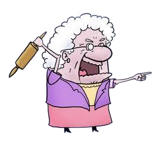

#Oly Gets Bunnies

## Premise: 

You are Oly. It is Spring time! Your favorite time of the year. Your goal is to kill as many bunnies as possible, and bring as many dead lifeless bodies to the stoop before your owner, Kate wakes up in the morning.

### Player Structure/Movement: 

You are a fast cat. You are in your prime and very agile. 
You move with the arrow keys. 
You have a powerful bite, that can take down a bunny in one go. 
How ever when you are carrying a bunny, you slow down a bit. 
You can drop the bunny and pick your speed back up. 

### Obstacles

Coyotes:
Beware. While you are known on the block for being the most ferocious feline, another beast lies in wait for you to let you guard down. A slower moving predator, hunts you with every move. 

Cars:
These mystical metal murdermachines come with no warning. Cross the road at your own parol. 

which rhymes with

Sharoll: 
This lady is crazy. She has thrown wrenches at you. She has swiped you with her broom. She tried to poison you that one time! Stay clear of Caroll! 

Mathew:
Now this downstairs neighbor is confused. He seems to love you, and then hate you. Something about having a baby bunny, writhing in your teeth seems to set him off... 

and lastly 

Time:
You were let out in the middle of the night, because you were causing a ruckus, and keeping your owner, Kate, from sleeping. 
Lucky for you, its your favorite time of the year. Spring time... also known as wabbit season. You have until the sun rises, to get as many bunny corpses on the stoop before Kate wakes up. Get to it! You want her to be proud of your work don't you?

## User Story
As a user, I want you: 

* to be able to move your character Oly, with the arrow keys. 
* to be able to bite a bunny with space bar
* to be able to pick up the bunny with space bar and drop the bunny by releasing spacebar
* to be able to score a point by dropping the bunny on the stoop
* to have to always be paying attention to the coyote that hunts you, and follows your every move
* to be weary of going near Mathew when you have a bunny. And to have to stay clear of Sharoll alltogether. 
* to have to be smart about when and how you cross the road. 
* to be able to strategically use the cars to deal with the coyote. 

## Technologies Used: 
*HTML
*CSS
*Javascript
*Canvas